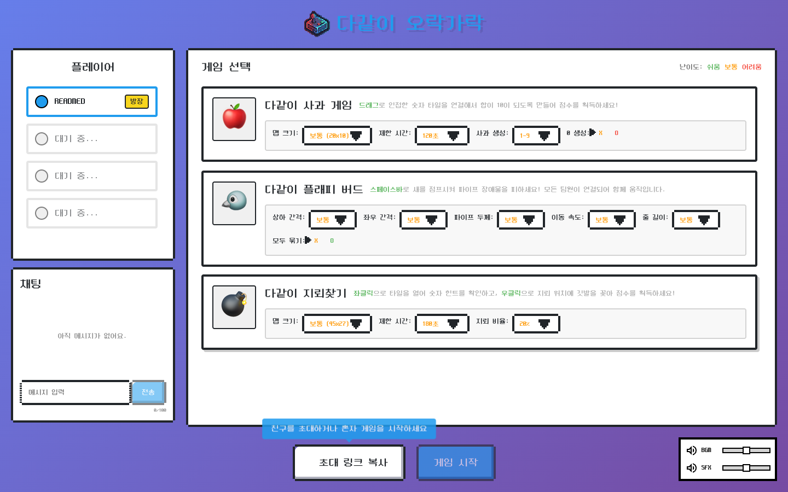
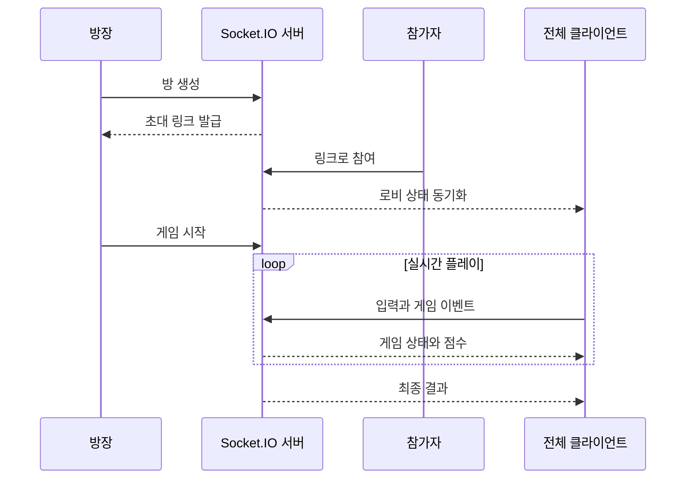

# 다같이 오락가락 (Orak-Garak)

초대 링크로 최대 4명이 사과게임, 플래피 버드, 지뢰찾기를 함께 플레이하는 실시간 웹 게임 허브입니다.

*A real-time multiplayer web game hub where up to four players join by invite link and play three games together.*

**[Live Demo](https://orak-garak.vercel.app/) · [Build & Deployment Guide](docs/build-and-deploy.md)**

## 문제와 사용자 경험

브라우저 게임마다 별도의 방과 사용자 흐름을 만들지 않고, 하나의 초대 링크와 로비에서 여러 게임을 선택해 함께 플레이할 수 있도록 구성했습니다.

1. 닉네임을 입력하고 방을 만듭니다.
2. 초대 링크를 공유해 최대 4명이 로비에 참여합니다.
3. 게임과 난이도·맵·시간 옵션을 선택합니다.
4. Socket.IO로 게임 상태와 점수를 실시간 동기화합니다.
5. 공통 결과 화면에서 최종 순위를 확인합니다.

## 핵심 기능

- 링크 기반 방 생성과 참여
- 최대 4인 로비, 참여자 상태와 채팅
- 사과게임, 플래피 버드, 지뢰찾기
- 게임별 난이도와 세부 옵션
- 실시간 입력·상태·점수 동기화
- 공통 게임 시작·종료·결과 인터페이스
- BGM·SFX와 반응형 게임 UI

## 멀티플레이 흐름

서버가 방과 게임 세션을 관리하고, 클라이언트는 React UI와 Phaser 게임 화면을 함께 갱신합니다. 공통 패킷 타입을 통해 세 게임이 같은 로비와 결과 흐름을 공유합니다.

## 주요 구현과 기술적 결정

- React가 로비·설정·결과 UI를 담당하고 Phaser가 게임 루프와 장면을 담당하도록 경계를 분리했습니다.
- `client`, `server`, `common` 패키지를 pnpm workspace로 구성해 실시간 패킷과 타입을 공유합니다.
- 게임별 입력과 판정을 Socket.IO 서버에 연결하고, 재접속·퇴장·방 정리 흐름을 공통 세션 계층에서 처리합니다.
- Vercel 프론트엔드와 Azure Container Apps 백엔드를 분리해 정적 UI 배포와 WebSocket 서버 운영 요구를 각각 충족했습니다.

## 검증과 현재 한계

서버 테스트는 방 생성·참여·퇴장, 게임 시작과 종료, 점수 및 게임별 동작을 확인합니다. `check:deploy` 명령은 전체 TypeScript 검사, 서버 테스트, 클라이언트와 서버 빌드를 하나의 배포 게이트로 묶습니다.

- 방과 게임 상태는 단일 Node.js 프로세스 메모리에 저장됩니다.
- 서버는 한 개 replica로 운영되며 수평 확장을 지원하지 않습니다.
- 서버 배포나 재시작 시 진행 중인 방이 초기화됩니다.
- 빈 방은 마지막 사용 후 1시간 뒤 제거됩니다.

## 기술 스택

| 영역 | 기술 |
| --- | --- |
| Client | React, TypeScript, Vite, Phaser, Zustand |
| Realtime | Socket.IO, shared packet types |
| Server | Node.js, TypeScript, Matter.js |
| Workspace | pnpm workspace |
| Delivery | GitHub Actions, Docker, GHCR, OIDC, Bicep |
| Hosting | Vercel, Azure Container Apps |

## 성과

- 카카오트랙 동계 현장실습 결과물
- 세 게임을 하나의 링크 초대·로비·결과 흐름으로 통합
- [Vercel 프론트엔드](https://orak-garak.vercel.app/)와 Azure Container Apps WebSocket 서버 배포
- GitHub Actions, GHCR, OIDC와 Bicep을 연결한 서버 검증·배포 자동화

## 관련 문서

- [빌드 및 배포 가이드](docs/build-and-deploy.md)
- [개발 가이드](DEVELOPMENT_GUIDE.md)
- [방 프로토콜](spec/room-protocol.md)
- [사과게임 프로토콜](spec/apple-game-protocol.md)
- [플래피 버드 프로토콜](spec/flappy-bird-protocol.md)
