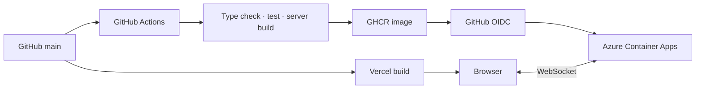

# Orak-Garak Build & Deployment Guide

이 문서는 Orak-Garak의 로컬 실행, 검증, Vercel 프론트엔드와 Azure Container Apps 서버 배포를 관리하는 canonical 문서입니다.

## 배포 아키텍처



`main`의 서버 변경은 GitHub Actions에서 검증한 뒤 commit SHA가 붙은 이미지를 GHCR에 게시하고 Azure에 배포합니다. 클라이언트는 Vercel에서 별도로 빌드되며 브라우저가 Azure의 Socket.IO 서버에 WebSocket으로 연결합니다.

## 요구 환경

- Node.js 24
- pnpm 9.12.3
- Corepack
- Docker(서버 이미지 확인 시)
- Azure CLI와 Bicep(인프라를 수동 검증할 때)

## 로컬 실행

```bash
git clone https://github.com/back0319/orak-garak.git
cd orak-garak
corepack enable
pnpm install --frozen-lockfile
```

터미널 두 개에서 서버와 클라이언트를 실행합니다.

```bash
pnpm dev:server
```

```bash
pnpm dev
```

- Client: http://localhost:5173
- Server: http://localhost:3000
- Health check: http://localhost:3000/health

## 환경 변수

| 변수 | 위치 | 공개 범위 | 설명 |
| --- | --- | --- | --- |
| `VITE_SERVER_URL` | Client | Browser | Socket.IO 서버 URL |
| `NODE_ENV` | Server | Server only | 실행 환경 |
| `PORT` | Server | Server only | HTTP·WebSocket 포트 |
| `ALLOWED_ORIGINS` | Server | Server only | 추가로 허용할 CORS origin 목록 |

로컬 클라이언트 설정:

```dotenv
VITE_SERVER_URL=http://localhost:3000
```

Production과 Preview 환경의 `VITE_SERVER_URL`은 Azure Container App의 HTTPS 주소를 사용합니다. 서버는 Production 도메인, Vercel Preview 패턴과 로컬 개발 origin만 허용합니다.

## 검증과 빌드

| 명령어 | 설명 |
| --- | --- |
| `pnpm type-check` | 공통·서버·클라이언트 TypeScript 검사 |
| `pnpm test:server` | 서버 세션과 게임 동작 테스트 |
| `pnpm build` | Vercel용 클라이언트 빌드 |
| `pnpm build:server` | Node.js 서버 번들 생성 |
| `pnpm lint` | 클라이언트 ESLint |
| `pnpm format:check` | 포맷 변경 없는 검사 |
| `pnpm check:deploy` | 타입, 테스트, 양쪽 빌드 통합 게이트 |

배포 전 기본 검증:

```bash
pnpm install --frozen-lockfile
pnpm check:deploy
```

## Vercel 프론트엔드

루트 [vercel.json](../vercel.json)이 다음을 정의합니다.

- Install: `pnpm install --frozen-lockfile`
- Build: `pnpm build`
- Output: `dist`
- SPA rewrite: `/invite/:roomId`와 나머지 경로를 `index.html`로 연결

`main`은 Production을, 다른 브랜치와 PR은 Preview를 갱신합니다.

## Azure 백엔드

[infra/azure/main.bicep](../infra/azure/main.bicep)의 현재 운영 기준:

| 항목 | 값 |
| --- | --- |
| Region | `koreacentral` |
| Container App | `orak-garak-server` |
| CPU / Memory | 0.25 vCPU / 0.5 GiB |
| Replica | 최소 1, 최대 1 |
| Ingress | 외부 HTTPS, target port 3000 |
| Health | `GET /health` |

루트 [Dockerfile](../Dockerfile)은 pnpm workspace에서 서버와 공통 패키지만 빌드하는 멀티스테이지 이미지입니다.

## GitHub Actions와 권한

[azure-backend.yml](../.github/workflows/azure-backend.yml)은 `main`의 서버·공통 패키지·Docker·Azure 설정 변경에서 실행됩니다.

1. 의존성을 고정 lockfile로 설치합니다.
2. 타입 검사, 서버 테스트와 서버 빌드를 실행합니다.
3. `ghcr.io/back0319/orak-garak-server:<commit-sha>` 이미지를 게시합니다.
4. GitHub OIDC로 Azure에 로그인합니다.
5. Bicep으로 Container App을 생성하거나 갱신합니다.

필요한 Actions secrets:

- `AZURE_CLIENT_ID`
- `AZURE_TENANT_ID`
- `AZURE_SUBSCRIPTION_ID`

장기 Azure client secret은 저장하지 않습니다. Federated credential은 `main` 브랜치의 저장소 subject로 제한합니다.

## 배포 후 점검

1. Azure 서버의 `GET /health`가 `ok: true`를 반환하는지 확인합니다.
2. Production에서 닉네임 입력 후 방이 생성되는지 확인합니다.
3. 초대 링크를 다른 브라우저나 기기에서 열어 같은 로비에 참여합니다.
4. 세 게임을 각각 시작하고 상태·점수·결과가 동기화되는지 확인합니다.
5. Vercel Preview가 Azure 서버 CORS를 통과하는지 확인합니다.

## 운영 제약과 장애 대응

- 인메모리 세션이므로 서버 재시작이나 새 revision 배포 시 진행 중인 방이 사라집니다.
- replica를 한 개로 유지해야 하며 확장하려면 외부 세션 저장소와 메시지 계층이 필요합니다.
- WebSocket 연결 실패 시 `VITE_SERVER_URL`, Azure ingress와 서버 CORS를 순서대로 확인합니다.
- 서버 오류는 Azure revision 로그와 `/health` probe 상태를 확인합니다.
- 서버 롤백은 이전 정상 commit SHA의 GHCR 이미지를 Bicep `image` 파라미터로 다시 배포합니다.
- 프론트엔드 롤백은 Vercel의 이전 정상 배포를 Production으로 승격합니다.
